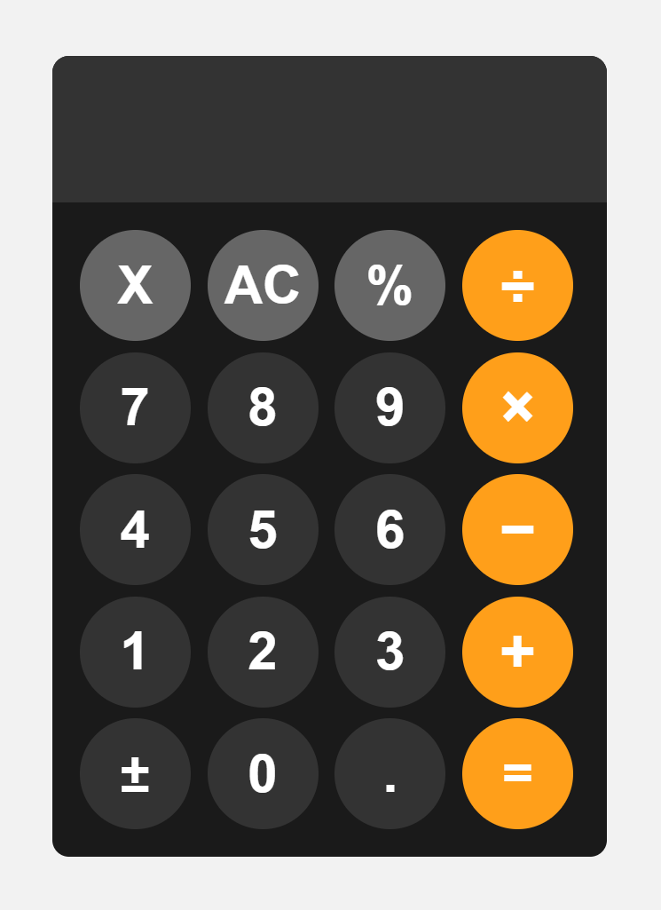

# 🧮 Simple Calculator JS


## 📌 Introduction

**Simple Calculator JS** is a basic web-based calculator built using **HTML, CSS, and JavaScript**.  
The project simulates a real calculator with a clean interface and supports common arithmetic operations.

## ✨ Features

- Basic arithmetic operations:
  - Addition (+)
  - Subtraction (−)
  - Multiplication (×)
  - Division (÷)
- Support for negative numbers (±)
- Delete last character (**X**)
- Clear all input (**AC**)
- Error handling: invalid expressions are kept unchanged
- Modern UI with circular buttons

## 🛠️ Technologies Used

- **HTML5** – Structure
- **CSS3** – Styling and layout
- **JavaScript (ES6)** – Logic and interaction

## 📂 Project Structure

```text
simple-calculator-js/
├── index.html
├── style.css
├── script.js
└── README.md
```

## 🚀 How to Run

1. Clone the repository:

   ```bash
   git clone https://github.com/USERNAME/simple-calculator-js.git
   ```

2. Navigate to the project folder:

   ```bash
   cd simple-calculator-js
   ```

3. Open `index.html` in your web browser

## 🖥️ Demo

<!-- Add a screenshot or GIF here -->

<p align="center">
  
</p>

<p align="center">
  🔗 <b>Live Demo:</b>
  <a href="https://vophamk23.github.io/simple-calculator-js/">https://vophamk23.github.io/simple-calculator-js/</a>
</p>

## 🎯 Project Goals

- Practice basic front-end development
- Understand DOM manipulation and event handling
- Apply JavaScript logic for calculator operations
- Create a responsive and user-friendly interface

## 👨‍💻 Author

**Name:** Vo Pham  
**Major:** Information Technology / Computer Engineering  
**GitHub:** [https://github.com/vophamk23](https://github.com/vophamk23)


